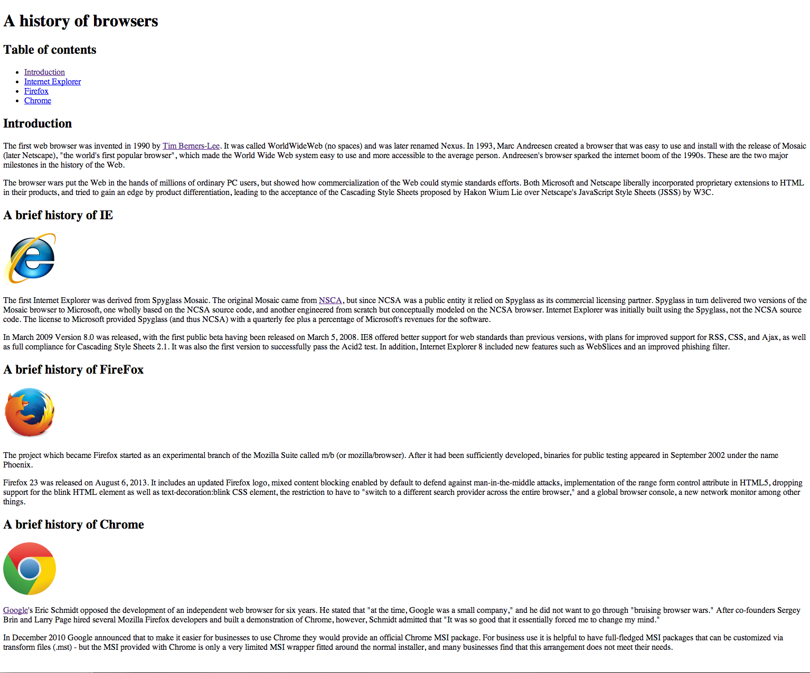
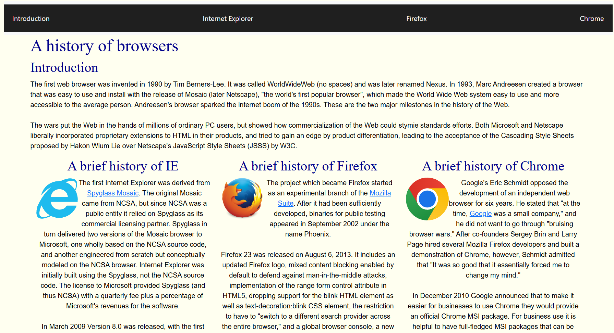
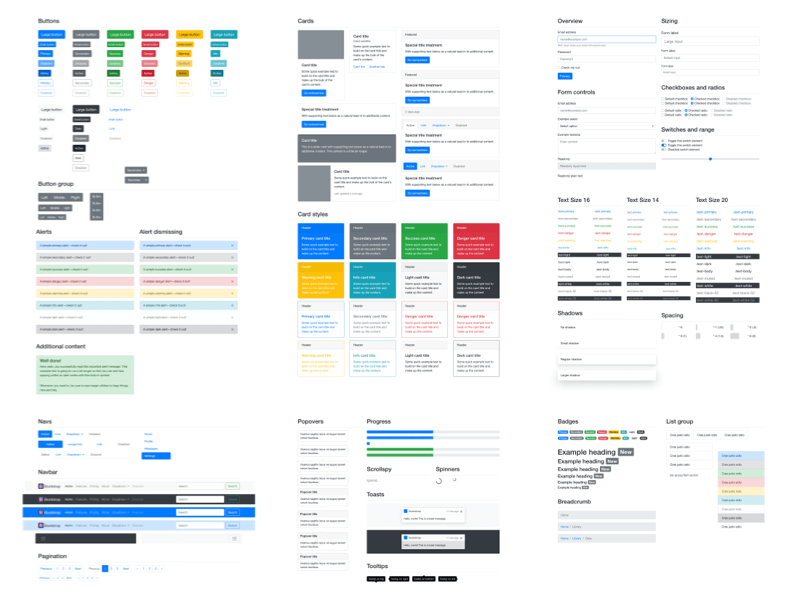

## What are UI Frameworks?

UI Frameworks can be thought of as a starter kit for developing user interfaces as they come with various features, options, and functionality to quickly produce effective, user-facing content.

## Why should we bother using UI Frameworks?

UI Frameworks like Bootstrap 5 are useful because they offer much more flexibility and depth when it comes to customizing webpages that would otherwise take much more time and effort to produce the same results without them.

## What's the difference?

**Here's an example of a simple webpage with raw html and no styling:**



It can be styled manually but many of the features we typically associate with websites like menus, navigation bars, icons, and adaptive design are time consuming to reproduce manually with raw html and css. This is why people use UI Frameworks to get rid of the time debt that would come from creating webpages in raw html and css because it simply makes sense to make the most out of the tools available to developers while still creating good looking webpages.

## Here's the difference

**Let's see the same page but built with Bootstrap and more styling:**



To include Bootstrap in the project, we include the scripts, links, and icon set inside of the head section of our html file.
```html
<!DOCTYPE html>
<html lang="en">
<head>
    <link href="https://cdn.jsdelivr.net/npm/bootstrap@5.3.8/dist/css/bootstrap.min.css" rel="stylesheet" integrity="sha384-sRIl4kxILFvY47J16cr9ZwB07vP4J8+LH7qKQnuqkuIAvNWLzeN8tE5YBujZqJLB" crossorigin="anonymous">
    <script src="https://cdn.jsdelivr.net/npm/bootstrap@5.3.8/dist/js/bootstrap.bundle.min.js" integrity="sha384-FKyoEForCGlyvwx9Hj09JcYn3nv7wiPVlz7YYwJrWVcXK/BmnVDxM+D2scQbITxI" crossorigin="anonymous"></script>
    <link rel="stylesheet" href="https://cdn.jsdelivr.net/npm/bootstrap-icons@1.11.1/font/bootstrap-icons.css">
    <link rel="stylesheet" href="style.css">
</head>
```

In return for the time and effort of learning the UI Framework, the webpage contains a navigation bar that houses links to the page contents, each of the three browsers are held in their own column div inside of a row div to get evenly spaced content. Having robust options available to the developer from the start instead of having to reimplement common webpage design features makes a strong case for the use of UI Frameworks as can be seen in the above example.



## My experience with UI Frameworks

Even though I acknowledge the importance and convenience of UI Frameworks in web development, I still can't deny that learning the tool is still a huge but necessary inconvenience. As a somewhat incompetent web developer, I am still proud of what I was able to build or recreate using these tools and being able to learn new things is a valuable skill to have in the everchanging world of Software Engineering but also in many aspects of life outside of it.

I still don't like web development and having to deal with organizing all the divs, make nav elements, sectioning the page, and adding the style, but I value the experience of learning these UI Frameworks and how they enable developers to be more efficient in creating the wonderful (and some not as much) webpages that we see and interact with everyday.
