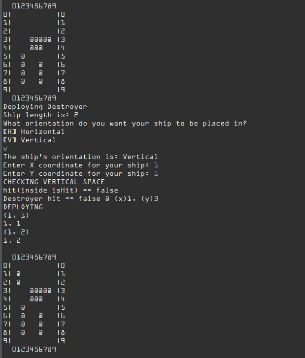

This project was an assignment for my "Computer Science A" class in high school for creating the ship deployment functionality of the board game Battleship in Java. Through this project, I learned about global variables and Object Oriented Programming (OOP) through creating the Ship class and its class functions to create and display the map, hold traits of the ships such as their placement orientation, length, and name, as well as verify whether there is a collision between ships. Upon running the program, the user is shown the map and prompted to choose the orientation and coordinates to place their 5 battleships (Carrier, Battleship, Cruiser, Submarine, and Destroyer), each their own object with parameters for the name, coordinates, and size. The map is updated and displayed for each ship placed and will prompt the user to pick different coordinates to place the ship if it detects a collision.

While not the complete game due to time constraints for the class, the project was a fun way to learn more about Java with 2D array iteration and error safety, OOP, and the connection between the user and the program. I enjoy games and creating them is a fun way to learn and pursue my interests so I felt that this project was beneficial to learning as well as boosting my interest in programming and Java.

Here is the function that deploys the ships:

```java
public void deployShips() {
	y = tempY;
	x = tempX;
	System.out.println("DEPLOYING");
	for (int i = 0; i < shipLength; i++) {
		//makes the ship placed vertically
		if (orientation == true) {
			if((y>= 0 && y< numRows) && (x>= 0 && x< numCols) && (grid[y][x].equals(" "))) //makes ship take up space on grid if empty
		        {
				//if there is a valid spot, places an "@" in the point on the grid to show it's occupied
				grid[y][x] =   "@";
				System.out.println("("+ x+", "+ y+")");
				savedPositionX[i] = x;
				savedPositionY[i] = y;
				System.out.println(savedPositionX[i]+", "+savedPositionY[i]);
		        }

		y++;
		
		} 
		if (orientation == false) {
			if((y>= 0 && y< numRows) && (x>= 0 && x< numCols) && (grid[y][x].equals(" ")) ) //makes ship take up space on grid if empty
		        {
				//if there is a valid spot, places an "@" in the point on the grid to show it's occupied
				grid[y][x] =   "@";
				System.out.println("("+ x+", "+ y+")");
				savedPositionX[i] = x;
				savedPositionY[i] = y;
				System.out.println(savedPositionX[i]+", "+savedPositionY[i]);

		        }
		        
		x++;
		}
	}
	printOceanMap();
}
```
